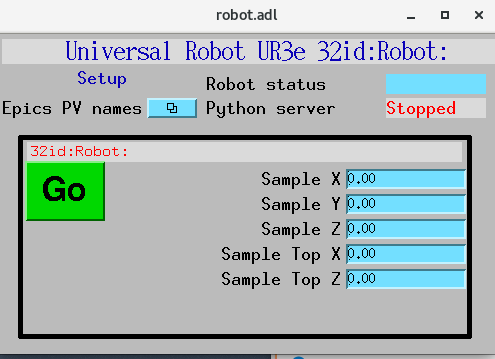
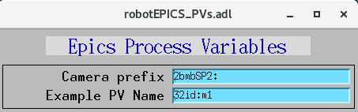

===============================
robotApp EPICS application
===============================

.. 
   toctree::
   :hidden:

   amcntrols.template
   robot_settings.req
   robot.substitutions

robot includes a complete EPICS application, including:

- A database file and corresponding autosave request file that contain the PVs required by the robot.py base class.
- OPI screens for medm
- An example IOC application that can be used to run the above databases.
  The databases are loaded in the IOC with the example substitutions file, 
  :doc:`robot.substitutions`.

Base class files
================
The following tables list all of the records in the robot.template file.
These records are used by the robot base class and so are required.

robot.template
--------------

This is the database file that contains only the PVs required by the amcontrol.py base class
:doc:`robot.template`.

Example PV Prefixes
^^^^^^^^^^^^^^^^^^^

.. cssclass:: table-bordered table-striped table-hover
.. list-table::
  :header-rows: 1
  :widths: 5 5 90

  * - Record name
    - Record type
    - Description
  * - $(P)$(R)CameraPVPrefix
    - stringout
    - Contains the prefix for the detector, e.g. 2bmbSP2:

Example PV name
---------------

.. cssclass:: table-bordered table-striped table-hover
.. list-table::
  :header-rows: 1
  :widths: 5 5 90

  * - Record name
    - Record type
    - Description
  * - $(P)$(R)ExamplePVName
    - stringout
    - Contains a PV name, e.g. 32id:m1

Sample pick-up location
^^^^^^^^^^^^^^^^^^^^^^^

.. cssclass:: table-bordered table-striped table-hover
.. list-table::
  :header-rows: 1
  :widths: 5 5 90

  * - Record name
    - Record type
    - Description
  * - $(P)$(R)SampleX
    - ao
    - Contains the Rayleigh Length value
  * - $(P)$(R)SampleY
    - ao
    - Contains the BeamWaist value
  * - $(P)$(R)SampleZ
    - ao
    - Contains the BeamWaistYPosition value
  * - $(P)$(R)SampleTopX
    - ao
    - Contains the DesiredBeamDiameter value
  * - $(P)$(R)SampleTopZ
    - ao
    - Contains the SampleHeight value

Robot status via Channel Access
^^^^^^^^^^^^^^^^^^^^^^^^^^^^^^^

.. cssclass:: table-bordered table-striped table-hover
.. list-table::
  :header-rows: 1
  :widths: 5 5 90

  * - Record name
    - Record type
    - Description
  * - $(P)$(R)Go
    - busy
    - Setting this record to 1 starts a control action.
  * - $(P)$(R)RobotStatus
    - waveform
    - This record will be updated with the scan status while scanning.
  * - $(P)$(R)ServerRunning
    - bi
    - This record will be ``Running`` if the Python server is running and ``Stopped`` if not.
      It is controlled by a watchdog timer, and will change from ``Running`` to ``Stopped``
      within 5 seconds if the Python server exits.

medm files
----------

robot.adl
^^^^^^^^^^^^^^

The following is the MEDM screen :download:`robot.adl <../../robotApp/op/adl/robot.adl>` during a scan. 
The status information is updating.

robotEPICS_PVs.adl
^^^^^^^^^^^^^^^^^^^^^^^

The following is the MEDM screen :download:`robotEPICS_PVs.adl <../../robotApp/op/adl/robotEPICS_PVs.adl>`. 

If these PVs are changed robot must be restarted.

