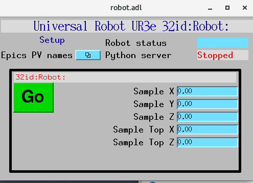

=====
Usage
=====

Start EPICS IOC
---------------

::

    fast@merlot $ cd ~/epics/synApps/support/robot/iocBoot/iocRobot
    fast@merlot $ ./start_IOC

at the end of the start up process you will get the IOC console::

   Starting iocInit
   ############################################################################
   ## EPICS R7.0.6.2-DEV
   ## Rev. R7.0.6.1-75-g91941af992f6c32ef4f4
   ############################################################################
   reboot_restore: entry for file 'auto_settings.sav'
   reboot_restore: Found filename 'auto_settings.sav' in restoreFileList.
   *** restoring from './autosave/auto_settings.sav' at initHookState 6 (before record/device init) ***
   reboot_restore: done with file 'auto_settings.sav'

   reboot_restore: entry for file 'auto_settings.sav'
   reboot_restore: Found filename 'auto_settings.sav' in restoreFileList.
   *** restoring from './autosave/auto_settings.sav' at initHookState 7 (after record/device init) ***
   reboot_restore: done with file 'auto_settings.sav'

   cas WARNING: Configured TCP port was unavailable.
   cas WARNING: Using dynamically assigned TCP port 44367,
   cas WARNING: but now two or more servers share the same UDP port.
   cas WARNING: Depending on your IP kernel this server may not be
   cas WARNING: reachable with UDP unicast (a host's IP in EPICS_CA_ADDR_LIST)
   iocRun: All initialization complete
   create_monitor_set("auto_settings.req", 30, "P=32id:,R=Robot:")
   save_restore:readReqFile: unable to open file robot.req. Exiting.
   epics> auto_settings.sav: 8 of 8 PV's connected
   epics>

If you do any modification to the **robot_settings.req** or **robot.template** files in::

   ~/epics/synApps/support/robot/robotApp/Db

you neeed to rebuld the epics IOC::

   epics> exit
   fast@merlot $ cd ../..
   fast@merlot $ make -sj
   fast@merlot $ cd iocBoot/iocRobot

and restart the IOC::

   fast@merlot $ ./start_IOC

You can accomplish the same with a single line command::

   fast@merlot $ cd ../.. ; make -sj ; cd iocBoot/iocRobot ; ./start_IOC

Start MEDM screen
-----------------

::

    fast@merlot $ cd ~/epics/synApps/support/robot/iocBoot/iocRobot
    fast@merlot $ ./start_medm

Start python server
-------------------

::

    $ bash
    (base) $ conda activate robot
    (robot) fast@merlot $ cd ~/epics/synApps/support/robot/iocBoot/iocRobot
    (robot) fast@merlot $ python -i start_robot.py
    configPVS:
    CameraPVPrefix : 2bmbSP2:
    ExamplePVName : 32id:m1
    RayleighLength : 50.00
    BeamWaist : 0
    BeamWaistYPosition : 0
    DesiredBeamDiameter : 0
    SampleHeight : 0
 
    controlPVS:
    Example : None
    Go : Done
    RobotStatus : 
    Watchdog : -38
 
    pv_prefixes:
    Camera : 2bmbSP2:
    >>>

If you do any modification to the python source code files in::

   ~/epics/synApps/support/robot/robot/

you neeed to rebuld the python server code::

   >>> exit()
   (robot) fast@merlot $ cd ../..
   (robot) fast@merlot $ python setup.py install
   (robot) fast@merlot $ cd iocBoot/iocRobot/
   (robot) fast@merlot $ python -i start_robot.py

You can accomplish the same with a single line command::

   (robot) fast@merlot $ cd ../../; python setup.py install; cd iocBoot/iocRobot/; python -i start_robot.py

